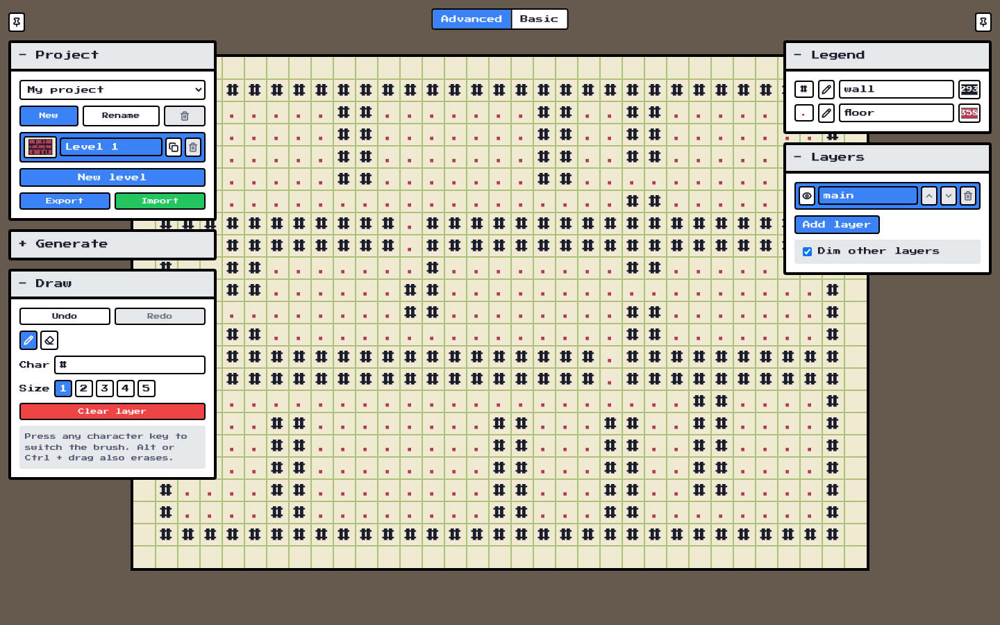

# ASCII Map Editor

This is a simple ASCII map editor useful especially for tile-based games.

## Live

- https://stmn.itch.io/ascii-map-editor
- https://stmn.github.io/ascii-map-editor

## Key features

- Basic and Advanced modes (Basic mirrors the original editor),
- Projects, levels and named layers, autosaved in your browser,
- Mazes and dungeons generators (the original v1 algorithms),
- Undo/redo, brush sizes, eraser, color legend,
- Export: TXT, CSV, array formats, KaPlay, Godot, Tiled `.tmx`, REXPaint `.xp`, JSON,
- Import with auto-detection (old v1 maps and `.xp` files load too).

## Limitations

- Browser storage limits apply (IndexedDB, localStorage fallback),
- Map size up to 199x199.

## Technicals

Under the hood: Vite + TypeScript, zero runtime dependencies.

- Dev: `npm run dev`
- Build: `npm run build`
- Tests: `npm test`
- Itch package: `npm run zip`

More details: [docs/manual.md](docs/manual.md)

## Credits

- Chirp Internet - chirpinternet.eu (Maze Builder)
- Lucide icons (ISC), Press Start 2P font (OFL) - see [LICENSES.md](LICENSES.md)
