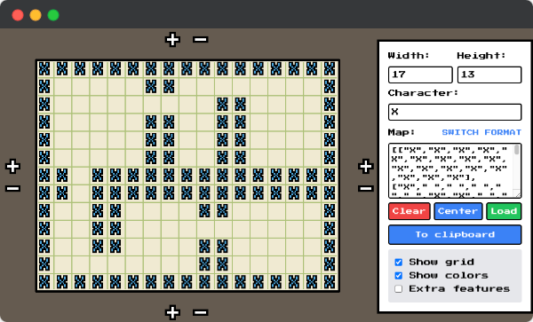

# ASCII Map Editor

This is a simple ASCII map editor useful especially for tile-based games.

## Live

- https://stmn.itch.io/ascii-map-editor
- https://stmn.github.io/ascii-map-editor

## Key features

- Mazes generator,
- Dungeons generator,
- Importing and exporting,
- 3 map formats:
  - array-array  
    `[[" ","a"," "],["b"," ","c"],[" ","d"," "]]`
  - array-text  
    `[" a ","b c"," d "]`
  - text  
    ` a
    b c
    d`
- Up to 999x999 map size

## Limitations

- Local storage limit - 5MB
- Zoom-out is limited due to performance issues (too many draws on canvas)

## Technicals

Under the hood project uses: Vite, Tailwind, AlpineJS, and KaboomJS

- Dev: `npm run dev`
- Build: `npm run build`

## Credits

- Chirp Internet - chirpinternet.eu (Maze Builder)

